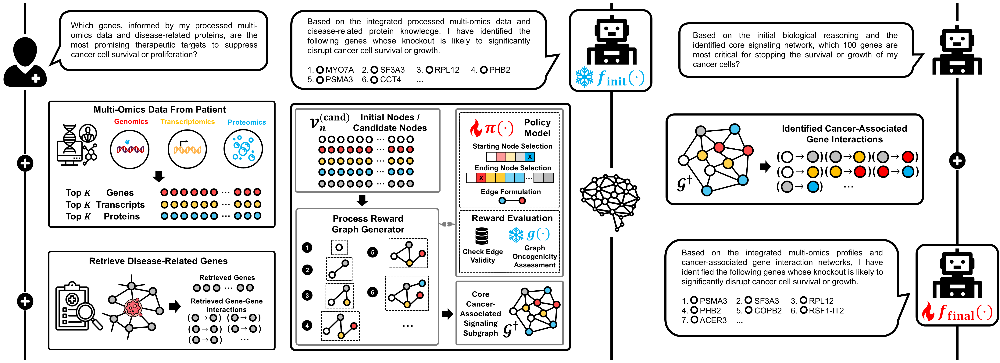

# GALAX: Graph-Augmented Language Model for Explainable Reinforcement-Guided Subgraph Reasoning in Precision Medicine: 

This repository is the official implementation of [GALAX](). 



## Requirements

To install requirements:

```setup
pip install -r requirements.txt
```

## 1. Download BioMedical Knowledge Graph
Check the website at [BioMedGraphica](https://github.com/FuhaiLiAiLab/BioMedGraphica) and download it to the path './data'

Then, run the code in each folder with entity and relation, with acquiring entities and relations.

## 2. Collect the DepMap data
Check the website at [DepMap](https://depmap.org/portal/data_page/?tab=overview) and download following links:

| **File Type**           | **File Name**                          | **Download Site**                                                                 |
|-------------------------|----------------------------------------|-----------------------------------------------------------------------------------|
| Promoter feature        | CCLE_RRBS_TSS1kb_20181022.txt          | [Link](https://depmap.org/portal/data_page/?tab=allData)                         |
| Gene feature            | OmicsCNGene.csv                        | [Link](https://depmap.org/portal/data_page/?tab=allData)                         |
| Transcript feature      | OmicsExpressionProteinCodingGenesTPMLogp1BatchCorrected.csv                  | [Link](https://depmap.org/portal/data_page/?tab=allData)                         |
| Protein feature         | protein_quant_current_normalized.csv   | [Link](https://depmap.org/portal/data_page/?tab=allData)                         |
| CRISPR gene effect      | CRISPRGeneEffect.csv                   | [Link](https://depmap.org/portal/data_page/?tab=allData)                         |
| Cell line annotation    | Table_S1_Sample_Information.xlsx       | [Link](https://depmap.org/portal/data_page/?tab=allData)                         |
| Cell line annotation    | cellosaurus.obo                        | [Link](https://ftp.expasy.org/databases/cellosaurus/cellosaurus.obo)            |
| Cell line status        | cell-lines-in-Non-Cancerous.csv        | [Link](https://depmap.org/portal/context/Non-Cancerous)                          |

And put them under the folder ./data/raw_data

## 3. Process the data
Just run the ./BMG/process.ipynb to get the integrated multi-omics data and Target-QA data with 'multi_sample_qa_info_k{k}_bm{top_bm}.json' (e.g., k=10, top_bm=100). And run the ./BMG/medtune.ipynb to get the 'mixed_description.jsonl'.

## 4. Pretrain the language model
Pretrain the llama3-8B-Instruct with 2 NVIDIA H100 (80G) GPUs by
```
accelerate launch --num_processes=4 pretrain_llama_fa.py
```

## 5. Pretrain the graph foundation model
### 5.1 Capturing the edge mechanism
Run the pretraining model
```
python motasg_pretrain.py
```

### 5.2 Pretrain the disease status classification
Run the classification pretraining model
```
python motasg_train.py
```

## 6. Training the GALAX
### 6.1 Run the model
Pretrain the initial answering with 2 NVIDIA H100 (80G) GPUs by
```
accelerate launch --multi_gpu --num_processes=4 --mixed_precision=bf16 finetune_llama.py
```

Then, run the GALAX reasoning with explainable subgraph
```
python GALAX.py
```

Then finetune the 2nd stage / final answering with 2 NVIDIA H100 (80G) GPUs by
```
accelerate launch --multi_gpu --num_processes=2 --mixed_precision=bf16 finetune_llama_2nd_step.py
```

### 6.3 Evaluate the model
```
python pan_sep_eval.py
```

## 7. Results

Our model achieves the following performance on :

**Table 1. Performance of models across datasets and metrics**  
| Model                    | Overall Precision ↑ | Overall Recall ↑ | LUAD Precision ↑ | LUAD Recall ↑ | BRCA Precision ↑ | BRCA Recall ↑ |
|--------------------------|--------------------:|-----------------:|-----------------:|--------------:|-----------------:|--------------:|
| M2T                     | 0.0016 | 0.0011 | 0.0020 | 0.0014 | 0.0000 | 0.0000 |
| GAT                     | 0.0006 ± 0.0000 | 0.0006 ± 0.0000 | 0.0000 ± 0.0000 | 0.0000 ± 0.0000 | 0.0033 ± 0.0000 | 0.0033 ± 0.0000 |
| L3 + Omics              | 0.0071 ± 0.0032 | 0.0013 ± 0.0002 | 0.0079 ± 0.0137 | 0.0005 ± 0.0008 | 0.0020 ± 0.0035 | 0.0017 ± 0.0029 |
| L3 + Omics + KG         | 0.0125 ± 0.0032 | 0.0029 ± 0.0003 | 0.0014 ± 0.0025 | 0.0010 ± 0.0017 | 0.0073 ± 0.0068 | 0.0033 ± 0.0029 |
| L3-FT(Med) + Omics      | 0.0179 ± 0.0045 | 0.0133 ± 0.0064 | 0.0091 ± 0.0018 | 0.0105 ± 0.0044 | 0.0110 ± 0.0086 | 0.0106 ± 0.0075 |
| L3-FT(Med) + Omics + KG | 0.0158 ± 0.0030 | 0.0058 ± 0.0011 | 0.0081 ± 0.0071 | 0.0024 ± 0.0017 | 0.0149 ± 0.0057 | 0.0050 ± 0.0000 |
| L3-FT(QA) + Omics       | 0.5250 ± 0.0282 | 0.4959 ± 0.0435 | 0.5201 ± 0.0408 | 0.4905 ± 0.0532 | 0.5074 ± 0.0498 | 0.4856 ± 0.0570 |
| L3-FT(QA) + Omics + KG  | 0.5185 ± 0.0240 | 0.4908 ± 0.0402 | 0.5214 ± 0.0242 | 0.4952 ± 0.0432 | 0.4856 ± 0.0395 | 0.4656 ± 0.0436 |
| G-Retriever + pre-GAT   | 0.4763 ± 0.0004 | 0.3929 ± 0.0063 | 0.4642 ± 0.0181 | 0.3881 ± 0.0264 | 0.4414 ± 0.0099 | 0.3772 ± 0.0010 |
| GALAX                   | **0.5472 ± 0.0053** | **0.5332 ± 0.0031** | **0.5345 ± 0.0185** | **0.5157 ± 0.0043** | **0.5608 ± 0.0031** | **0.5533 ± 0.0033** |

---

**Table 2. Hit@10 and Hit@5 for models across datasets**  
| Model                    | Overall Hit@10 ↑ | Overall Hit@5 ↑ | LUAD Hit@10 ↑ | LUAD Hit@5 ↑ | BRCA Hit@10 ↑ | BRCA Hit@5 ↑ |
|--------------------------|-----------------:|----------------:|--------------:|-------------:|--------------:|-------------:|
| M2T                     | 0.0029 | 0.0000 | 0.0000 | 0.0000 | 0.0000 | 0.0000 |
| GAT                     | 0.0000 ± 0.0000 | 0.0000 ± 0.0000 | 0.0000 ± 0.0000 | 0.0000 ± 0.0000 | 0.0000 ± 0.0000 | 0.0000 ± 0.0000 |
| L3 + Omics              | 0.0021 ± 0.0037 | 0.0032 ± 0.0055 | 0.0048 ± 0.0082 | 0.0095 ± 0.0165 | 0.0000 ± 0.0000 | 0.0000 ± 0.0000 |
| L3 + Omics + KG         | 0.0122 ± 0.0033 | 0.0085 ± 0.0037 | 0.0000 ± 0.0000 | 0.0000 ± 0.0000 | 0.0056 ± 0.0096 | 0.0111 ± 0.0192 |
| L3-FT(Med) + Omics      | 0.0122 ± 0.0072 | 0.0116 ± 0.0097 | 0.0000 ± 0.0000 | 0.0000 ± 0.0000 | 0.0111 ± 0.0192 | 0.0000 ± 0.0000 |
| L3-FT(Med) + Omics + KG | 0.0132 ± 0.0040 | 0.0106 ± 0.0048 | 0.0048 ± 0.0082 | 0.0095 ± 0.0165 | 0.0111 ± 0.0192 | 0.0000 ± 0.0000 |
| L3-FT(QA) + Omics       | 0.8693 ± 0.0157 | 0.8889 ± 0.0168 | 0.8667 ± 0.0218 | 0.8476 ± 0.0165 | 0.8389 ± 0.0096 | **0.8889 ± 0.0509** |
| L3-FT(QA) + Omics + KG  | 0.8529 ± 0.0153 | 0.8794 ± 0.0114 | 0.8048 ± 0.0541 | 0.7905 ± 0.0436 | 0.8222 ± 0.0347 | 0.8778 ± 0.0192 |
| G-Retriever + pre-GAT   | 0.8550 ± 0.0046 | 0.8804 ± 0.0037 | 0.8524 ± 0.0165 | 0.8857 ± 0.0000 | **0.8667 ± 0.0000** | 0.8667 ± 0.0000 |
| GALAX                   | **0.8815 ± 0.0033** | **0.9249 ± 0.0048** | **0.8810 ± 0.0082** | **0.9238 ± 0.0436** | 0.8500 ± 0.0441 | **0.8889 ± 0.0839** |


## 📋 License and Contributions

This project is licensed under the [MIT License](LICENSE), which permits reuse, modification, and distribution for both commercial and non-commercial purposes, provided that the original license is included with any copies of the code.