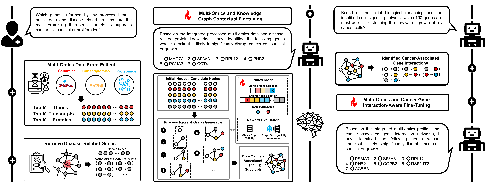

# GALAX: Graph-Augmented Language Model for Explainable Reinforcement-Guided Subgraph Reasoning in Precision Medicine: 

This repository is the official implementation of [GALAX](). 



## Requirements

To install requirements:

```setup
pip install -r requirements.txt
```

## 1. Download BioMedical Knowledge Graph
Check the website at [BioMedGraphica](https://github.com/FuhaiLiAiLab/BioMedGraphica) and download it to the path './data'

Then, run the code in each folder with entity and relation, with acquiring entities and relations.

## 2. Collect the DepMap data
Check the website at [DepMap](https://depmap.org/portal/data_page/?tab=overview) and download following links:

| **File Type**           | **File Name**                          | **Download Site**                                                                 |
|-------------------------|----------------------------------------|-----------------------------------------------------------------------------------|
| Promoter feature        | CCLE_RRBS_TSS1kb_20181022.txt          | [Link](https://depmap.org/portal/data_page/?tab=allData)                         |
| Gene feature            | OmicsCNGene.csv                        | [Link](https://depmap.org/portal/data_page/?tab=allData)                         |
| Transcript feature      | OmicsExpressionProteinCodingGenesTPMLogp1BatchCorrected.csv                  | [Link](https://depmap.org/portal/data_page/?tab=allData)                         |
| Protein feature         | protein_quant_current_normalized.csv   | [Link](https://depmap.org/portal/data_page/?tab=allData)                         |
| CRISPR gene effect      | CRISPRGeneEffect.csv                   | [Link](https://depmap.org/portal/data_page/?tab=allData)                         |
| Cell line annotation    | Table_S1_Sample_Information.xlsx       | [Link](https://depmap.org/portal/data_page/?tab=allData)                         |
| Cell line annotation    | cellosaurus.obo                        | [Link](https://ftp.expasy.org/databases/cellosaurus/cellosaurus.obo)            |
| Cell line status        | cell-lines-in-Non-Cancerous.csv        | [Link](https://depmap.org/portal/context/Non-Cancerous)                          |

And put them under the folder ./data/raw_data

## 3. Process the data
Just run the ./BMG/process.ipynb to get the integrated multi-omics data and Target-QA data with 'multi_sample_qa_info_k{k}_bm{top_bm}.json' (e.g., k=10, top_bm=100). And run the ./BMG/medtune.ipynb to get the 'mixed_description.jsonl'.

## 4. Pretrain the language model
Pretrain the llama3-8B-Instruct with 2 NVIDIA H100 (80G) GPUs by
```
accelerate launch --num_processes=4 pretrain_llama_fa.py
```

## 5. Pretrain the graph foundation model
### 5.1 Capturing the edge mechanism
Run the pretraining model
```
python motasg_pretrain.py
```

### 5.2 Pretrain the disease status classification
Run the classification pretraining model
```
python motasg_train.py
```

## 6. Training the GALAX
### 6.1 Split the data 
```
python qa_train_test.py
```


### 6.2 Run the model
Pretrain the initial answering with 2 NVIDIA H100 (80G) GPUs by
```
accelerate launch --multi_gpu --num_processes=4 --mixed_precision=bf16 finetune_llama.py
```

Then, run the GALAX reasoning with explainable subgraph
```
python GALAX.py
```

Then finetune the 2nd stage / final answering with 2 NVIDIA H100 (80G) GPUs by
```
<!-- accelerate launch --multi_gpu --num_processes=2 --mixed_precision=bf16 finetune_llama_2nd_step.py -->
accelerate launch --multi_gpu --num_processes=2 --mixed_precision=bf16 --main_process_port=0 finetune_llama_2nd_step.py
```


### 6.3 Other baseline models
The LLM based models
```
python plainllm_omics.py
python plainllm_omicskg.py
python bmgcllm_omics.py
python bmgcllm_omicskg.py
python qallm_omics.py
python qallm_omicskg.py
```

The Graph-based model
```
python motasg_crispr_ko.py
python motasg_crispr_ko_analysis.py
```

The Graph Language model
```
python g-Retriever.py
```


### 6.4 Evaluate the model
```
python pan_sep_eval.py
```

## 7. Results

Our model achieves the following performance on :

**Table 1. Performance of models across datasets and metrics**
| Model                      | Overall Precision ↑     | Overall Recall ↑        | LUAD Precision ↑         | LUAD Recall ↑            | PAAD Precision ↑         | PAAD Recall ↑            |
|---------------------------|-------------------------|--------------------------|---------------------------|---------------------------|---------------------------|---------------------------|
| M2T                       | 0.002                   | 0.0013                   | 0.002                     | 0.0014                    | 0.0023                    | 0.0017                    |
| GAT                       | 0.0109 ± 0.0            | 0.0109 ± 0.0             | 0.0129 ± 0.0              | 0.0129 ± 0.0              | 0.0133 ± 0.0              | 0.0133 ± 0.0              |
| L3 + omic                | 0.0077 ± 0.0034         | 0.0015 ± 0.0             | 0.0101 ± 0.0059           | 0.0021 ± 0.001            | 0.0 ± 0.0                 | 0.0 ± 0.0                 |
| L3 + omic + KG           | 0.0155 ± 0.0024         | 0.0044 ± 0.0013          | 0.0034 ± 0.0048           | 0.0021 ± 0.003            | 0.0469 ± 0.0423           | 0.01 ± 0.0024             |
| L3-FT(Med) + omic        | 0.0192 ± 0.0009         | 0.0139 ± 0.0035          | 0.0203 ± 0.0057           | 0.0107 ± 0.001            | 0.0315 ± 0.002            | 0.0117 ± 0.0024           |
| L3-FT(Med) + omic + KG   | 0.0309 ± 0.0016         | 0.013 ± 0.0006           | 0.0193 ± 0.0026           | 0.0056 ± 0.0002           | 0.0598 ± 0.0103           | 0.0259 ± 0.0013           |
| L3-FT(CRISPR) + omic     | 0.4191 ± 0.0043         | 0.4105 ± 0.0014          | 0.4233 ± 0.0423           | 0.4071 ± 0.0384           | 0.4304 ± 0.0322           | 0.4275 ± 0.0342           |
| L3-FT(CRISPR) + omic + KG| 0.4056 ± 0.0048         | 0.3982 ± 0.0067          | 0.4236 ± 0.0251           | 0.405 ± 0.0333            | 0.3918 ± 0.0046           | 0.39 ± 0.0047             |
| G-Retriever + pre-GAT    | 0.3606 ± 0.0029         | 0.3354 ± 0.0012          | 0.3718 ± 0.0              | 0.3029 ± 0.0              | 0.3283 ± 0.0              | 0.3217 ± 0.0              |
| **GALAX**                | **0.5468 ± 0.0036**     | **0.5439 ± 0.0014**      | **0.5533 ± 0.0047**       | **0.5636 ± 0.0051**       | **0.4943 ± 0.0084**       | **0.4933 ± 0.0071**       |


**Table 2. Hit@10 and Hit@5 for models across datasets**
| Model                      | Overall Hit@10 ↑        | Overall Hit@5 ↑         | LUAD Hit@10 ↑            | LUAD Hit@5 ↑             | PAAD Hit@10 ↑            | PAAD Hit@5 ↑             |
|---------------------------|-------------------------|--------------------------|---------------------------|---------------------------|---------------------------|---------------------------|
| M2T                       | 0.0055                  | 0.0                      | 0.0                       | 0.0                       | 0.0                       | 0.0                       |
| GAT                       | 0.0018 ± 0.0            | 0.0036 ± 0.0             | 0.0143 ± 0.0              | 0.0286 ± 0.0              | 0.0 ± 0.0                 | 0.0 ± 0.0                 |
| L3 + omic                | 0.0045 ± 0.0013         | 0.0091 ± 0.0026          | 0.0143 ± 0.0              | 0.0286 ± 0.0              | 0.0 ± 0.0                 | 0.0 ± 0.0                 |
| L3 + omic + KG           | 0.0091 ± 0.0026         | 0.0091 ± 0.0077          | 0.0071 ± 0.0101           | 0.0 ± 0.0                 | 0.025 ± 0.0118            | 0.05 ± 0.0236             |
| L3-FT(Med) + omic        | 0.0173 ± 0.0013         | 0.0164 ± 0.0026          | 0.0214 ± 0.0101           | 0.0 ± 0.0                 | 0.0417 ± 0.0118           | 0.0667 ± 0.0471           |
| L3-FT(Med) + omic + KG   | 0.0325 ± 0.0003         | 0.0187 ± 0.0007          | 0.0 ± 0.0                 | 0.0 ± 0.0                 | 0.113 ± 0.0052            | 0.0676 ± 0.0013           |
| L3-FT(CRISPR) + omic     | 0.8618 ± 0.0077         | 0.9055 ± 0.0103          | 0.8571 ± 0.0              | 0.8857 ± 0.0404           | 0.9 ± 0.0                 | 0.9667 ± 0.0471           |
| L3-FT(CRISPR) + omic + KG| 0.8545 ± 0.0            | 0.8927 ± 0.0026          | 0.8286 ± 0.0202           | 0.9 ± 0.0202              | 0.9083 ± 0.0118           | 0.9667 ± 0.0              |
| G-Retriever + pre-GAT    | 0.8636 ± 0.0            | 0.9018 ± 0.0             | 0.8286 ± 0.0              | 0.8857 ± 0.0              | 0.8667 ± 0.0              | 0.9 ± 0.0                 |
| **GALAX**                | **0.8891 ± 0.0026**     | **0.9345 ± 0.0051**      | **0.9429 ± 0.0202**       | **0.9429 ± 0.0404**       | **0.875 ± 0.0118**        | **0.9667 ± 0.0471**       |

 

## 📋 License and Contributions

This project is licensed under the [MIT License](LICENSE), which permits reuse, modification, and distribution for both commercial and non-commercial purposes, provided that the original license is included with any copies of the code.
